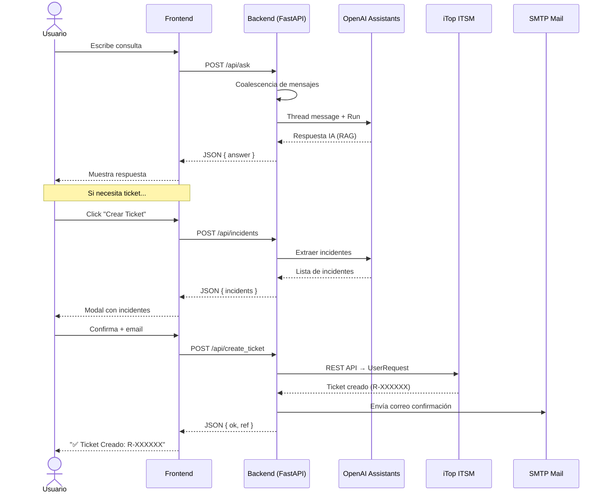

<p align="center">
  
</p>

<h1 align="center">🤖 Chatbot TI — Hermes</h1>

<p align="center">
  <strong>Asistente Inteligente de Auto-Servicio para Soporte TI Corporativo</strong><br>
  <em>Powered by OpenAI Assistants API · iTop ITSM · FastAPI</em>
</p>

<p align="center">
  
  
  
  
  
  
</p>

---

## 📋 Tabla de Contenidos

- [Descripción](#-descripción)
- [Características](#-características)
- [Arquitectura](#-arquitectura)
- [Stack Tecnológico](#-stack-tecnológico)
- [Estructura del Proyecto](#-estructura-del-proyecto)
- [Instalación](#-instalación)
- [Configuración](#-configuración)
- [Ejecución](#-ejecución)
- [Docker](#-docker-deployment)
- [Base de Conocimiento (RAG)](#-base-de-conocimiento-rag)
- [API Endpoints](#-api-endpoints)
- [Flujo del Sistema](#-flujo-del-sistema)
- [Roadmap](#-roadmap)

---

## 🎯 Descripción

**Chatbot TI Hermes** es un asistente inteligente de auto-servicio diseñado para el área de Soporte TI de **Hermes Transportes Blindados S.A.**

Resuelve consultas frecuentes de los colaboradores (FAQs), guía configuraciones, y cuando no puede resolver un problema, permite **crear tickets directamente en iTop** desde la interfaz del chat.

> 💡 **Objetivo principal:** Reducir la carga operativa del Helpdesk permitiendo que los usuarios resuelvan incidencias comunes de forma autónoma, las 24/7.

---

## ✨ Características

### 🧠 Inteligencia Artificial
- **RAG (Retrieval-Augmented Generation)** con documentos internos de Hermes
- **OpenAI Assistants API** con threads persistentes para contexto conversacional
- Detección de intención semántica (match parafraseado de FAQs)
- Extracción automática de incidentes desde la conversación

### 🎫 Gestión de Tickets (iTop)
- Creación automática de tickets `UserRequest` en iTop ITSM
- Consulta de estado de tickets con **tracker visual animado** (stepper)
- Búsqueda directa de tickets por referencia (ej. `R-058310`)
- Historial local de tickets recientes

### 📧 Notificaciones
- Envío de correos de confirmación vía SMTP corporativo
- Notificación automática al Helpdesk y al usuario

### 🎨 Interfaz Moderna
- Diseño **Glassmorphism** con identidad corporativa Hermes (Azul/Rojo)
- **Dark Mode** con logo adaptativo (`hermes_no_bg.png`)
- Sidebar con historial de tickets y búsqueda rápida
- Markdown rendering en respuestas del bot
- Responsive design
- Animaciones y micro-interacciones (pulse en tracker, hover effects)

### ⚙️ Backend Robusto
- **Sesiones persistentes** en SQLite (sobreviven reinicios)
- **Coalescing de mensajes** (agrupa ráfagas del usuario en una sola consulta)
- Auto-reset de sesiones por inactividad configurable
- Thread cache con recuperación automática de threads corruptos
- GC automático de sesiones expiradas
- Puerto auto-libre con detección de conflictos
- Manejo global de errores → siempre JSON

---

## 🏗 Arquitectura

```
┌─────────────────────────────────────────────────────────┐
│                    USUARIO (Navegador)                   │
│  ┌───────────────────────────────────────────────────┐  │
│  │           Frontend (static/index.html)            │  │
│  │  Glassmorphism UI · Dark Mode · LocalStorage      │  │
│  └───────────────────────┬───────────────────────────┘  │
└──────────────────────────┼──────────────────────────────┘
                           │ HTTP/JSON
┌──────────────────────────┼──────────────────────────────┐
│                FastAPI Backend (app_openai.py)           │
│  ┌───────────────────────┼───────────────────────────┐  │
│  │              API Routes & Session Manager          │  │
│  │  /api/ask · /api/incidents · /api/create_ticket   │  │
│  └──────┬────────────────┼─────────────────┬─────────┘  │
│         │                │                 │            │
│  ┌──────▼──────┐  ┌──────▼──────┐  ┌──────▼──────┐    │
│  │  openai_    │  │  itop_      │  │  email_     │    │
│  │  utils.py   │  │  client.py  │  │  utils.py   │    │
│  │  Assistants │  │  REST API   │  │  SMTP       │    │
│  └──────┬──────┘  └──────┬──────┘  └──────┬──────┘    │
│         │                │                 │            │
│  ┌──────▼──────┐  ┌──────▼──────┐  ┌──────▼──────┐    │
│  │   OpenAI    │  │   iTop      │  │  Servidor   │    │
│  │   Cloud     │  │   ITSM      │  │  Correo     │    │
│  └─────────────┘  └─────────────┘  └─────────────┘    │
│                                                         │
│  ┌─────────────────────────────────────────────────┐    │
│  │          SQLite (data/chatbot.db)                │    │
│  │  sessions · messages · thread cache             │    │
│  └─────────────────────────────────────────────────┘    │
└─────────────────────────────────────────────────────────┘
```

---

## 🛠 Stack Tecnológico

| Capa | Tecnología | Versión |
|------|-----------|---------|
| **Backend** | Python + FastAPI | 3.11+ / 0.115.3 |
| **Servidor ASGI** | Uvicorn | 0.30.6 |
| **IA / LLM** | OpenAI Assistants API | SDK 1.51.2 |
| **ITSM** | iTop REST API | 1.3 |
| **Base de Datos** | SQLite3 | Built-in |
| **Email** | SMTP (smtplib) | Built-in |
| **Frontend** | HTML5 + CSS3 + JavaScript | Vanilla |
| **Fuente** | Google Fonts (Inter) | — |
| **Deploy** | Docker + Docker Compose | — |
| **Versionado** | Git + GitHub | — |

---

## 📁 Estructura del Proyecto

```
chatbot_ti_htb/
│
├── 📄 app_openai.py          # API principal (FastAPI + rutas + sesiones)
├── 📄 openai_utils.py         # Lógica OpenAI (Assistants API, threads, RAG)
├── 📄 itop_client.py          # Cliente iTop (crear tickets, consultar estado)
├── 📄 email_utils.py          # Utilidades SMTP (envío de correos)
│
├── 📁 static/                 # Frontend
│   ├── index.html             # Interfaz principal (Glassmorphism UI)
│   ├── logo.png               # Logo Hermes (modo claro)
│   └── hermes_no_bg.png       # Logo Hermes (modo oscuro, sin fondo)
│
├── 📁 rag/                    # Base de conocimiento (PDFs para RAG)
│   ├── Preguntas Frecuentes.pdf
│   ├── PreguntasIA_v2.pdf
│   ├── COMPROBANTE DE SERVICIO WEB.pdf
│   ├── Guía Anulación Entregas desde HW.pdf
│   ├── Guía Cliente CS Web - Metales - v2.pdf
│   ├── Registro de firmas WEB.pdf
│   └── contexto_hermes_glosario_helpdesk.pdf
│
├── 📁 test/                   # Scripts de prueba
│   ├── test_openai_api.py     # Test conexión OpenAI
│   ├── send_test_email.py     # Test envío SMTP
│   ├── itop_catalog.py        # Explorar catálogo iTop
│   ├── itop_estados.py        # Explorar estados iTop
│   └── itop_status.py         # Test consulta ticket
│
├── 📁 data/                   # Base de datos SQLite (auto-generada)
│
├── 🐳 Dockerfile.api          # Imagen Docker (Python 3.11 slim)
├── 🐳 docker-compose.yml      # Orquestación con volumen persistente
│
├── 📄 requirements.txt        # Dependencias Python
├── 📄 run_bot.bat             # Script de ejecución local (Windows)
├── 📄 .env                    # Variables de entorno (NO versionado)
├── 📄 .env.prod               # Variables de producción (NO versionado)
└── 📄 .gitignore              # Exclusiones de Git
```

---

## 🚀 Instalación

### Pre-requisitos

- **Python 3.11+**
- **OpenAI API Key** con acceso a Assistants API
- **iTop** con API REST habilitada
- (Opcional) **Docker** para deployment

### 1. Clonar repositorio

```bash
git clone https://github.com/eportaro/chatbot_ti_htb.git
cd chatbot_ti_htb
```

### 2. Crear entorno virtual

```bash
python -m venv venv

# Windows
venv\Scripts\activate

# Linux/Mac
source venv/bin/activate
```

### 3. Instalar dependencias

```bash
pip install -r requirements.txt
```

---

## ⚙️ Configuración

Crea un archivo `.env` en la raíz del proyecto:

```env
# === OpenAI ===
OPENAI_API_KEY=sk-proj-XXXXXXXXXX
ASSISTANT_ID=asst_XXXXXXXXXX

# === iTop ITSM ===
ITOP_BASE_URL=http://tu-servidor-itop/webservices/rest.php?version=1.3
ITOP_USER=usrRest
ITOP_PASS=tu_password
ITOP_ORG_ID=4
ITOP_CALLER_ID=4083
ITOP_SERVICE_ID=16
ITOP_SUBCAT_ID=67
ITOP_TEAM_ID=                  # Opcional
ITOP_TEAM_NAME=IT-Helpdesk     # Nombre del equipo asignado
ITOP_AGENT_ID=                 # Opcional

# === SMTP (correo corporativo) ===
SMTP_HOST=mail.tudominio.com
SMTP_PORT=587
SMTP_MODE=starttls             # "starttls" o "ssl"
SMTP_USER=usuario@tudominio.com
SMTP_PASS='tu_password'
SMTP_FROM=usuario@tudominio.com
SMTP_TO=ti.soporte@tudominio.com
SMTP_HELPDESK_TO=ithelpdesk@tudominio.com

# === Avanzado (opcionales) ===
COALESCE_SEC=2.5               # Ventana de agrupación de mensajes (segundos)
PORT=8000                      # Puerto del servidor
PURGE_DAYS=2                   # Días antes de limpiar sesiones inactivas
INACTIVITY_RESET_MIN=45        # Minutos de inactividad para resetear sesión
ASSISTANTS_RUN_TIMEOUT_SECS=90 # Timeout para respuesta del Assistant
MAX_CTX_MSGS=20                # Máximo de mensajes de contexto
```

---

## ▶️ Ejecución

### Windows (local)

```batch
run_bot.bat
```

O directamente:

```bash
python app_openai.py
```

### Salida esperada

```
✅ Servidor activo en:
→ Local: http://127.0.0.1:8000
→ LAN:   http://10.72.19.20:8000
```

Abre tu navegador en **http://localhost:8000** 🚀

---

## 🐳 Docker Deployment

### Build & Run

```bash
# Construir imagen
docker compose build

# Ejecutar
docker compose up -d

# Ver logs
docker compose logs -f chatbot_ti_api
```

### Producción

```bash
# Usar archivo de entorno de producción
docker compose --env-file .env.prod up -d
```

### Arquitectura Docker

```
┌──────────────────────────┐
│    chatbot_ti_api        │
│    Python 3.11 slim      │
│    Puerto: 8000          │
│    Usuario: appuser      │
│    ┌──────────────────┐  │
│    │ Volume: db-data  │  │
│    │ /app/data/       │  │
│    │ chatbot.db       │  │
│    └──────────────────┘  │
└──────────────────────────┘
```

---

## 📚 Base de Conocimiento (RAG)

Los documentos en `rag/` son cargados al **OpenAI Assistant** como vector store para búsqueda semántica:

| Documento | Contenido |
|-----------|-----------|
| `Preguntas Frecuentes.pdf` | FAQs generales de TI |
| `PreguntasIA_v2.pdf` | FAQs optimizadas para IA |
| `contexto_hermes_glosario_helpdesk.pdf` | Glosario y contexto corporativo |
| `COMPROBANTE DE SERVICIO WEB.pdf` | Guía de comprobantes web |
| `Guía Anulación Entregas desde HW.pdf` | Proceso de anulación |
| `Guía Cliente CS Web - Metales - v2.pdf` | Manual CS Web Metales |
| `Registro de firmas WEB.pdf` | Proceso de registro de firmas |

> 📌 Para actualizar la base de conocimiento, sube nuevos PDFs al Assistant en la consola de OpenAI.

---

## 🔌 API Endpoints

| Método | Ruta | Descripción |
|--------|------|-------------|
| `GET` | `/` | Sirve el frontend (`static/index.html`) |
| `GET` | `/static/{path}` | Archivos estáticos (logo, CSS, etc.) |
| `POST` | `/api/ask` | Envía pregunta al Assistant → respuesta IA |
| `POST` | `/api/incidents` | Extrae incidentes detectados de la conversación |
| `POST` | `/api/create_ticket` | Crea ticket(s) en iTop + envía correo |
| `POST` | `/api/ticket_status` | Consulta estado de ticket por referencia |

### Ejemplo: `/api/ask`

```json
// Request
{
  "question": "¿Cómo me conecto a la VPN?",
  "session_id": "abc-123"
}

// Response
{
  "answer": "Para conectarte a la VPN de Hermes, sigue estos pasos...",
  "session_id": "abc-123"
}
```

### Ejemplo: `/api/ticket_status`

```json
// Request
{ "ref": "R-058310" }

// Response
{
  "ok": true,
  "fields": {
    "ref": "R-058310",
    "title": "Teclado malogrado",
    "status": "assigned",
    "agent_id_friendlyname": "Soporte N1",
    "caller_id_friendlyname": "Juan Pérez",
    "priority": "2",
    "start_date": "2026-02-17 10:00:00",
    "last_update": "2026-02-17 11:30:00"
  }
}
```

---

## 🔄 Flujo del Sistema



---

## 🗺 Roadmap

- [x] Interfaz Glassmorphism con identidad corporativa Hermes
- [x] Integración OpenAI Assistants API con RAG
- [x] Creación de tickets en iTop
- [x] Tracker visual de estado de tickets
- [x] Búsqueda de tickets en sidebar
- [x] Dark mode con logo adaptativo
- [x] Notificaciones por correo
- [x] Persistencia SQLite + sesiones con auto-GC
- [x] Docker deployment
- [ ] Análisis de imágenes (capturas de pantalla de errores)
- [ ] Integración con Active Directory para login corporativo
- [ ] Audio input (speech-to-text)
- [ ] Dashboard de métricas y analytics
- [ ] Sugerencias inteligentes (chips/botones rápidos)

---

## 👥 Equipo

| Rol | Nombre |
|-----|--------|
| **Desarrollo & Arquitectura** | Eduardo Portaro — TI Hermes |

---

## 📄 Licencia

Proyecto privado de **Hermes Transportes Blindados S.A.**  
Uso interno exclusivo. Todos los derechos reservados.

---

<p align="center">
  <strong>Hermes Transportes Blindados S.A.</strong><br>
  <em>Innovación en Tecnología de la Información</em><br>
  📧 ithelpdesk@hermes.com.pe · ☎️ (01) 617-4000 anexo 5555
</p>
